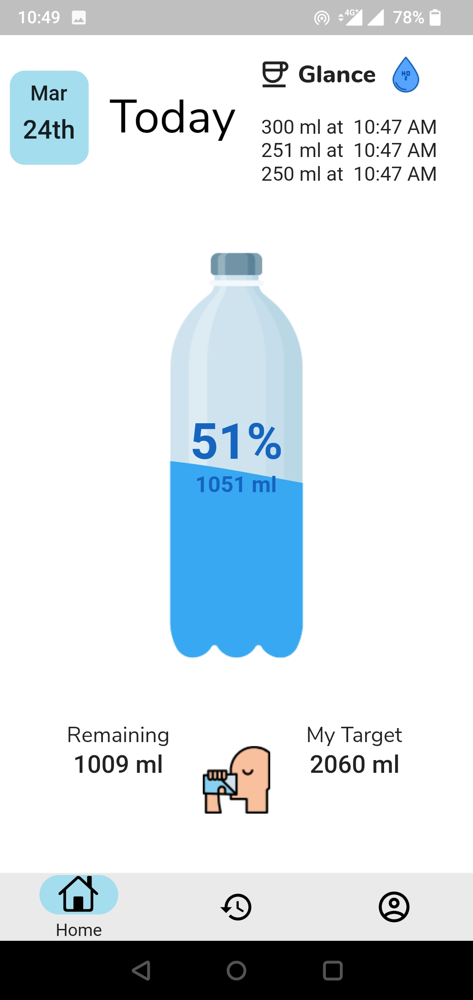
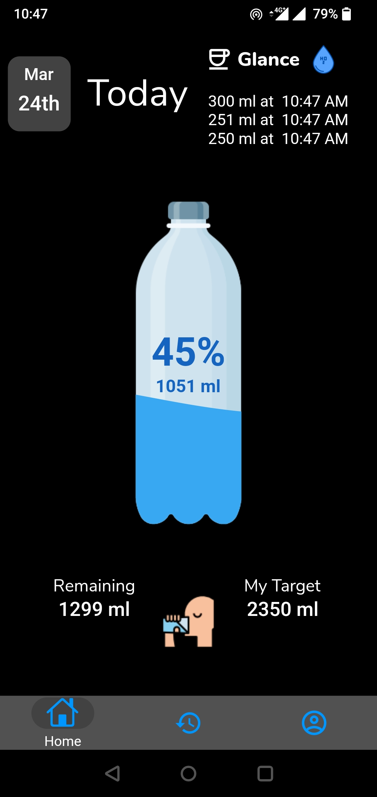
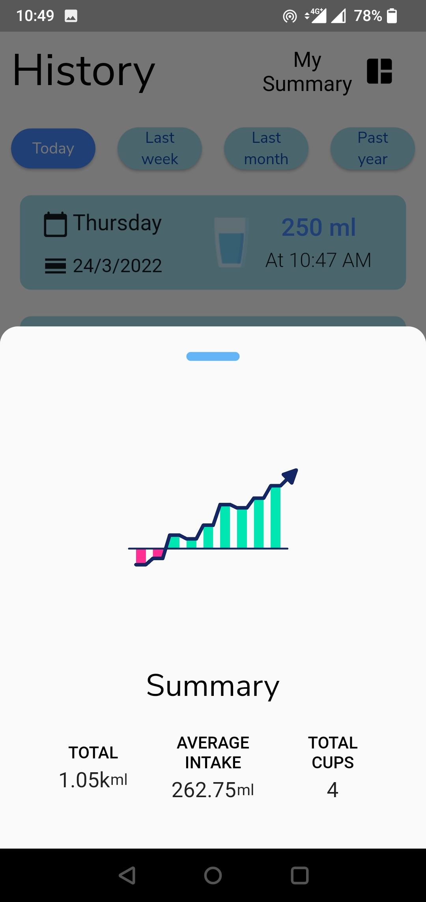
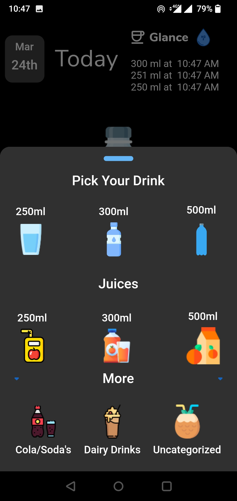
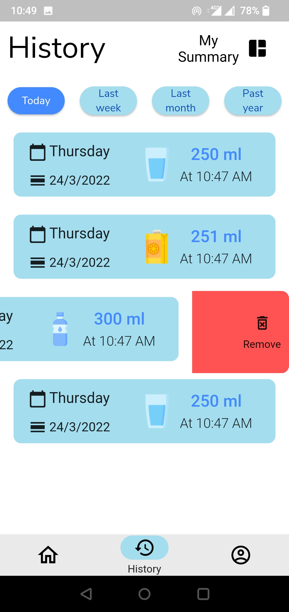
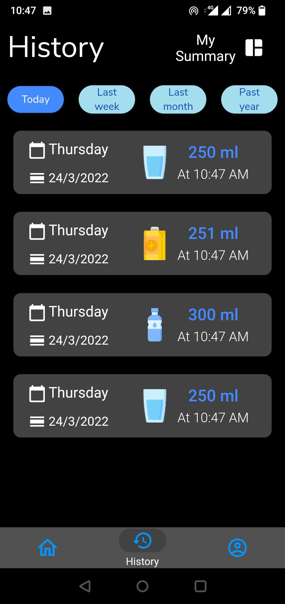
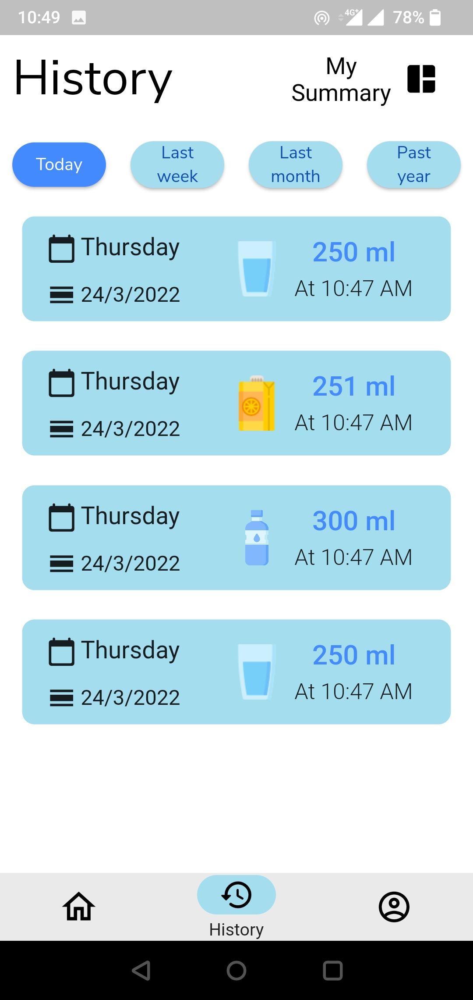
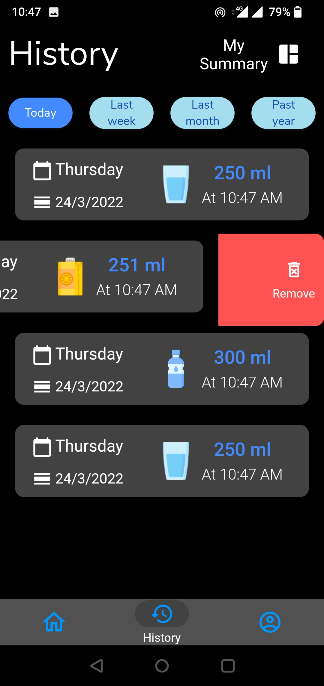
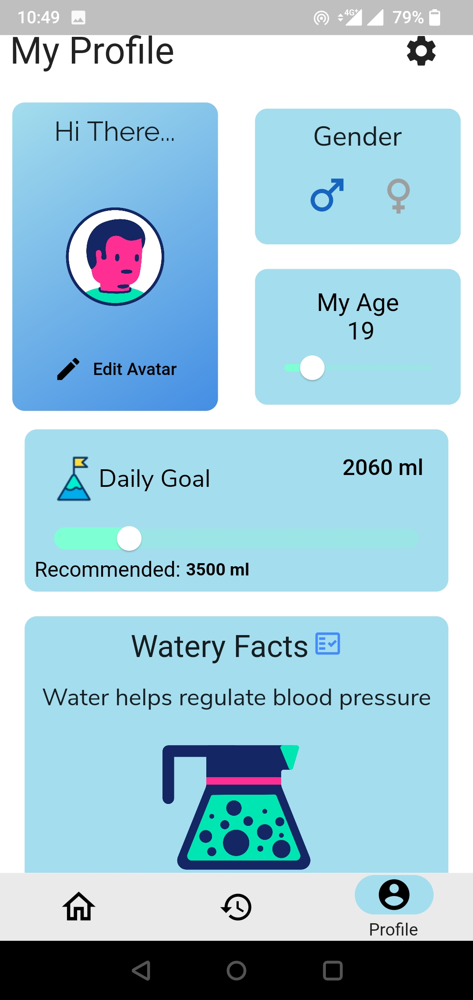
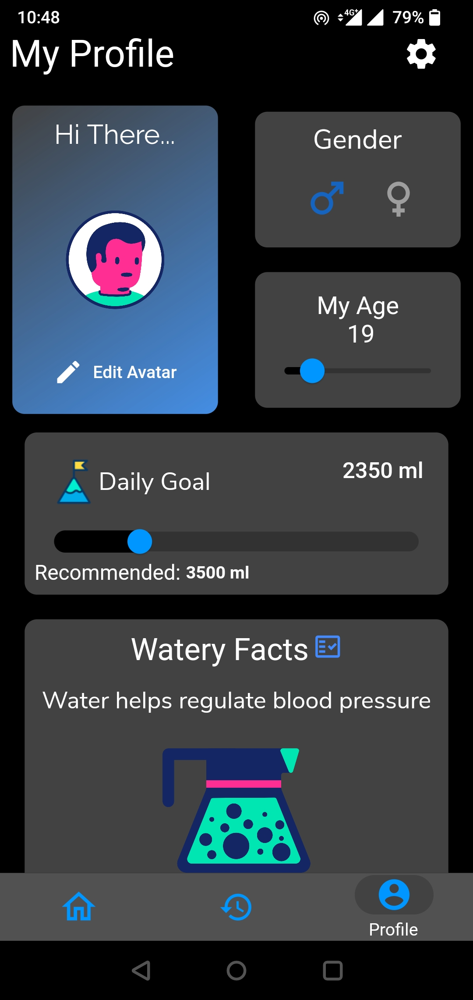

# Drink Up

Hydrating monitoring mobile app project

#### 💻 Requirements

#### SetUp Repo

Get your flutter environment up and running.

- [Clone Repo](https://github.com/Anslem27/Get-Hydrated.git)
- Fetch Packages: `flutter pub get`
- Run App: `flutter run` assuming you have a working emulator

## Features

- [x] Record water and Juice Intake.
- [x] Personal profile page
- [x] Dark and Light Modes
- [x] Swipe to delete history.

## Whats not working(Pending)

- 🚩 Notifications
- 🚩 Additional intakes i.e sodas

## TODO

- [x] Add custom drinks

## 📸 ScreenShots

| Light                                  | Dark                                   |
| ---------------------------------      | ---------------------------------      |
|  |   |
|   |   |
|   |   |
|   |   |
|   |   |

## Pub Dev Packages

| Package                                                 | Usage                                               |
| ------------------------------------------------------- | --------------------------------------------------- |
| [**Redux**](https://pub.dev/packages/redux)             | State Management                                    |
| [**sqflite**](https://pub.dev/packages/sqflite)         | Local database                                      |
| [**Illustrations**](https://icons8.com/illustrations)   | General illustrations used in the app                         |
